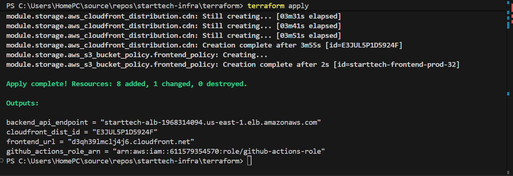
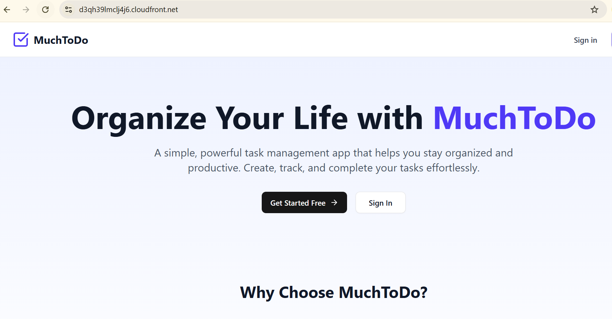
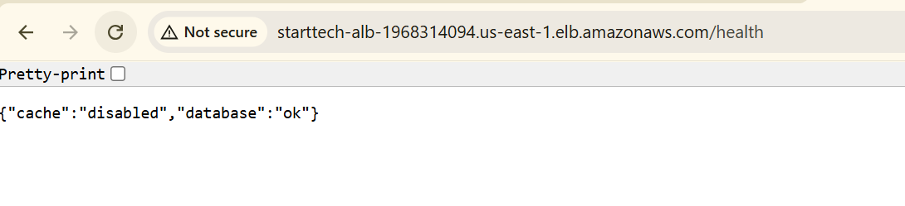
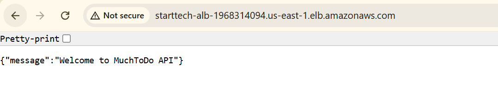
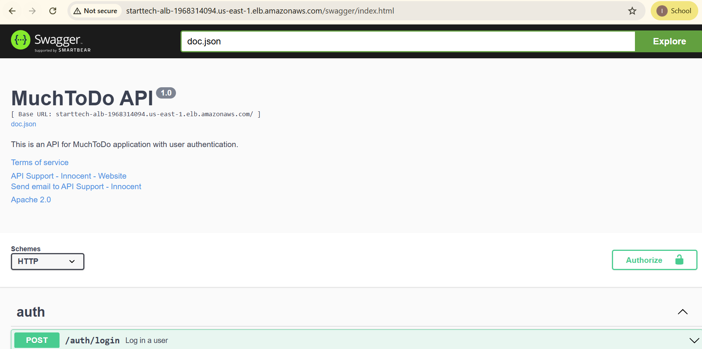

# StartTech-Infra: AWS Cloud Infrastructure

This repository contains the **Terraform** configurations used to architect and deploy the high-availability environment for the "MuchToDo" application. It automates the provisioning of networking, compute, and load-balancing resources on AWS.


## 🏗️ Architecture Design
- **Custom VPC**: A dedicated network with public subnets across multiple Availability Zones (AZs) to ensure high availability.
- **Application Load Balancer (ALB)**: A Layer 7 load balancer that handles incoming HTTP traffic and distributes it to the backend containers.
- **Auto Scaling Group (ASG)**: Manages the lifecycle of EC2 instances, providing self-healing capabilities by automatically replacing unhealthy instances.
- **Security Groups**: Implements a tiered security model where the ALB is open to the internet (Port 80) and the Application Instances only accept traffic from the ALB (Port 8080).
- **Automated Bootstrapping**: Uses EC2 User Data to install Docker, configure environment variables, and pull the latest application image from GitHub Container Registry (GHCR).

## 🛠️ Infrastructure Stack
- **Cloud Provider**: AWS (Amazon Web Services)
- **Infrastructure as Code**: Terraform v1.5+
- **Container Runtime**: Docker
- **Source of Truth**: Environment-driven configuration via `terraform.tfvars`

## 📂 Repository Structure
```text
.
├── main.tf                # Root module: orchestrates VPC, ALB, and Compute
├── variables.tf           # Input variable definitions
├── terraform.tfvars       # Environment-specific values (Sensitive - Not committed)
├── outputs.tf             # Important outputs like ALB DNS and Instance IDs
└── modules/
    ├── vpc/               # Subnets, IGW, and Route Table logic
    ├── alb/               # Load Balancer and Target Group definitions
    └── compute/           # Launch Templates and Auto Scaling logic

```


# StartTech-App: Backend API (Go)

A high-performance Task Management API built with **Go (Golang)**, **MongoDB Atlas**, and **Redis**, deployed on a scalable **AWS Infrastructure** via **Terraform**.


## 🚀 Project Overview
This project serves as the backend for the "MuchToDo" application. It implements a secure, containerized REST API that follows cloud-native best practices, including automated health checks, environment-driven configuration, and high availability.

## 🛠️ Tech Stack
- **Language:** Go 1.25+ (Gin Gonic Framework)
- **Database:** MongoDB Atlas (NoSQL)
- **Cache:** Redis (ElastiCache/Cloud)
- **Infrastructure:** Terraform & AWS (VPC, ASG, ALB)
- **Containerization:** Docker & GitHub Container Registry (GHCR)

## 📋 Key Configuration Fixes
During development, the following critical issues were resolved to ensure cloud stability:
- **URI Sanitization:** Implemented `strings.Trim` logic in `config.go` to handle shell-injected quotes in connection strings.
- **Viper Mapping:** Configured `SetEnvKeyReplacer` to ensure environment variables correctly map to Go structs.
- **AWS Networking:** Aligned ALB Target Group health checks (Port 8080) with Docker container mapping.

## 📡 API Endpoints
| Method | Endpoint | Description |
| :--- | :--- | :--- |
| `GET` | `/` | Health Check (DB & Cache Status) |
| `POST` | `/auth/register` | User Registration |
| `POST` | `/auth/login` | JWT Authentication |
| `GET` | `/todos` | Fetch User Tasks (Protected) |

## 🏗️ AWS Infrastructure
The infrastructure is defined as code (IaC) and includes:
- **Application Load Balancer:** Handles incoming traffic on Port 80.
- **Auto Scaling Group:** Ensures at least one instance is always running.
- **Launch Template:** Automatically bootstraps EC2 instances with Docker and the latest app image.


---

## 📸 Deployment Evidence
The following snapshots confirm the successful deployment and connectivity of the system.

<details>
<summary>📂 Click to view Infrastructure Evidence</summary>

### Infrastructure Provisioning
**Terraform Apply**
> Verification of successful resource creation on AWS.


**Frontend CDN**
> Confirmation of frontend assets hosted via CDN.

</details>

<details>
<summary>📂 Click to view Backend & API Evidence</summary>

### Backend Connectivity
**Health Route**
> Confirms the Go backend is running and the `/health` endpoint is reachable.


**API Base URL**
> Verification of the live API endpoint.


**API Documentation**
> Evidence of accessible Swagger/OpenAPI documentation.

</details>

---

### 🚀 Technical Summary
* **Backend:** Go (Golang) service running in Docker.
* **Database:** MongoDB Atlas (Cloud).
* **Infrastructure:** Provisioned via Terraform (ALB, ASG, VPC).
* **CI/CD:** Automated via GitHub Actions with image hosting on GHCR.